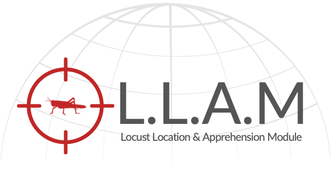

<p align="center">
</p>

L.L.A.M - Locust Location & Apprehension Module[ Version 2]
=======================

>  "Save crops from locust attacks"

**Web App**: <a target="_blank" href="https://locustlocator2.vercel.app">https://locustlocator2.vercel.app 🔗</a>

### This Idea was born here : https://devpost.com/software/locust-build on August 2020
## What does this project do? 🤔

L.L.A.M tracks the realtime locusts location and visualizes wind patterns on earth.
Predicts the probability of locust attacks on a particular given position through satellite imagery using machine learning regression models.

## Who did we design this project for? 👨🏻‍🌾

This project is designed keeping the problems that farmers face due to locusts in mind. We aim to reduce the destruction of crops caused by locusts which leads to massive effect on socio-economic interests of farmers. This is at moment intended for NGOs and government organisations.

## What was the inspiration for this project? 💡

The inspiration behind L.L.A.M was that locusts are increasingly becoming a great threat to the vegetation and this threat is reportedly going to increase each year. To safeguard crops and farmers from this plague we needed some solution that could tackle the problem well.


## What challenges did we run into? 🤯

- The first challenge we ran into was how will we collect the relevant data.
- Then we had to decide how will we visualize the frontend with that data.
- Changing code to fit our Next js frontend framework.
- Populate data with efficiency because alot of gpu power was required.
- Rendering terrains and maps in Cesium Js.

## What accomplishments are we most proud of? 👏

- Visualizing the data on 3d earth.
- ML model predictions from satellite imagery.
- Implemented multiple algorithms including RNN, Regression, etc.
- Used Image processing techniques for optimised results.
- Team did phenomenal job at helping each other and integrating stuff together. 

## What we learned ? 🧠

- Using Microsoft Azure services for creating sick APIs.
- Cesium Js framework to render and perform functions on 3D earth.
- Amazing Next Js features.

## What's next for L.L.A.M🚀

- More optimization has to be made on the UI.
- Improve accuracy
- Add layer to predict locust movement using wind data


## More about the project 🔥

**Web App**: https://locustlocator2.vercel.app 🔗


<h4 align="center">Tracking feature</h4>


<h4 align="center">Wind patterns and locusts visualized</h4>


<h4 align="center">Zoomed in view of location where potential locust is found</h4>


<h4 align="center">Predicting locust attack on a particular location</h4>


<h4 align="center"><a target="_blank" href="https://drive.google.com/file/d/1g6OHy5ZD4szA-MYwIqhsx4ThTgVz9s6F/view?usp=sharing">ML pipeline 🔗</a></h4>

<a target="_blank" href="https://drive.google.com/file/d/1g6OHy5ZD4szA-MYwIqhsx4ThTgVz9s6F/view?usp=sharing">
</a>

Prerequisites
-------------

- [NextJS](https://nextjs.org)
- [Node.js 10+](http://nodejs.org)
- Command Line Tools
- **Mac OS X:** [Xcode](https://itunes.apple.com/us/app/xcode/id497799835?mt=12) (or **OS X 10.9+**: `xcode-select --install`)
 - **Windows:** [Visual Studio](https://www.visualstudio.com/products/visual-studio-community-vs) OR [Visual Studio Code](https://code.visualstudio.com) + [Windows Subsystem for Linux - Ubuntu](https://docs.microsoft.com/en-us/windows/wsl/install-win10)

 - **Ubuntu** / **Linux Mint:** `sudo apt-get install build-essential`
 - **Fedora**: `sudo dnf groupinstall "Development Tools"`


Getting Started 🎬
---------------

The easiest way to get started is to clone the repository:

```bash
# Get the latest snapshot
git clone https://github.com/Jappan07/LLAM

# Change directory
cd LLAM

# Install NPM dependencies
npm install

# Then simply start your app
npm run dev
```


```bash
# project will start at localhost:3000
https://localhost:3000
```

**Note:** GPU intensive features are added into this project so it is suggested to run this application on a machine having dedicated gpu so that it could run smoothly. 

# Research and FAQ

## 1. What is a locust attack/invasion/plague?
When the locusts start attacking crops and thereby destroy the entire agricultural economy, it is referred to as locust plague/locust invasion. Plagues of locusts have devastated societies since the Pharaohs led ancient Egypt, and they still wreak havoc today.  Over 60 countries are susceptible to swarms.
## 2. Types of locusts -
There are four types of locusts that create a plague namely– desert locust, migratory locust, Bombay locust, and tree locust. The desert locust is a notorious species. Found in Africa, the Middle East, and Asia, this species inhabits an area of about six million square miles, or 30 countries, during a quiet period, according to National Geographic. During a plague, when large swarms descend upon a region, however, these locusts can spread out across some 60 countries and cover a fifth of Earth's land surface.
## Q. How and when do locusts become harmful?
During dry spells, solitary locusts are forced together in the patchy areas of land with remaining vegetation. This sudden crowding makes locusts. Then, when rains return—producing moist soil and abundant green plants, locusts begin to reproduce rapidly and become even more crowded together. In these circumstances, they shift completely from their solitary lifestyle to a group lifestyle in what’s called the gregarious phase. Locusts can even change color and body shape when they move into this phase. Their endurance increases and even their brains get larger. Locusts have huge appetites. One of these insects can eat its weight in food in a single day. And they're devastating crops in East Africa, where millions of people are already considered food-insecure.
## Q. What is a locust swarm?
Locust swarms are typically in motion and can cover vast distances—some species may travel 81 miles or more a day. Locust swarms devastate crops and cause major agricultural damage, which can lead to famine and scarcity. A swarm of desert locusts comprising around 40 million locusts can deplete (or destroy) food that would suffice the hunger needs of 35,000 people, assuming that one person consumes around 2.3 kg of food every day. In 1954, a swarm flew from northwest Africa to Great Britain, while in 1988, another made the lengthy trek from West Africa to the Caribbean, a trip of more than 3,100 miles in just 10 days. Locust swarms devastate crops and cause major agricultural damage, which can lead to famine and starvation. Locusts occur in many parts of the world, but today locusts are most destructive in subsistence farming regions of Africa.
## Q. Locust Effect on Africa?
The worst locust outbreak in generations has overrun East Africa and the Horn of Africa. Without timely action, 4.9 million people could face a shortage this summer. This disaster comes at the worst possible time for countries like Somalia already facing the double emergency of food shortage and COVID-19. Seven facts about the situation on the ground:
1. Desert locusts are extremely harmful – These migrating insects inflict insurmountable defects in minutes. Even a tiny swarm eats the same amount of food in one day as 35,000 people. Swarms have already razed hundreds of thousands of hectares of crops and pastureland in eight countries—Kenya, Uganda, South Sudan, Ethiopia, Somalia, Eritrea, Djibouti, and Sudan—and terrorize to spread wider.
2. Five million people are at risk of hunger and famine- As of March, the locust infestation in East Africa has already hurt more than 25,000 kilometers of cropland. Without swift intervention, populations will face mass scarcity this summer.
3. A new swarm is hatching – The fourth generation of locust eggs is now hatching, which experts predict will create a locust population 8,000 times huger than the recent infestation.
4. Somalia will likely be hit hardest – The Somali government was first in the region to assert a national emergency in response to the desert-locust crisis. Without humanitarian assistance, 3.5 million people are cast to face a food crisis between July and September. The region is already dazed by cycles of broad violence, drought, floods, chronic food deficits, and illness.
5. This the worst outbreak in 70 years – Without expedited preventive gauges, swarms will depart from East Africa to West Africa. “This is the worst locust invasion we have seen in our generation,” says Sahal Farah of Docol, an IRC partner organization. “It razed grasses, infected water sources, and [has] deposed many pastoral households. The worst of all is that we cannot control it, and so far we have not received any external support.”
6. Women face increased risk – If crops fail, the IRC totals that 5,000 families, mainly those led by women, will need urgent humanitarian assistance by August. As food prices skyrocket, women and girls will face a rise in chaos and theft as their partners are urged to travel in search of food and work. Besides, women will be forced to take on more duties in managing existing farms or small jobs, even as they tend to the needs of their homes.
7. More grants are essential to stop extensive famine – The IRC is calling for $1.98 million to relieve the desert-locust disaster in Somalia in 2020. We are also bidding to the United Nations and affected countries to continue the technical inquiry of locust actions along with continued data sharing—before it is too late.

## Q. How can locust swarming/attack be prevented?
Weather patterns and ancient locust records help us predict where swarms might form. Once known, an area is sprayed with chemicals to kill locusts before they can gather.  Historically, locust control has involved the spraying of organophosphate pesticides on the night resting places of the locusts. Intervention in the early stages of a locust case is mainly advised. This reduces the amount of pesticide to be applied because the locusts are localized over a very minor region. As a burst resumes to evolve first into an upsurge then into a plague, more and more countries are affected and much larger areas need to be treated. Still, a preventive method may not always be useful. Entry to infested areas may be limited due to insecurity, financial and human aids can’t be rallied soon enough to control an attack in time, or weather and environmental factors are barely favorable for locust expansion so the national control capacity is overwhelmed. So, what can be done?
HERE COMES THE USE OF LOCUST LOCATOR

Locust swarm attacks can be prevented with early monitoring of the breeding grounds of the insects. Now, the United Nations is already doing this work. Through various ground, air, and satellite surveillance techniques, image processing methods, data analysis, and a various modus operandi, scientists, researchers, biologists are serving day in and day out to build a model, or a method so that these attacks can be prevented before they grow to wreak massive damage and havoc. But, the common man cannot infer the need or purpose behind all this.
This is a problem where experts with years of experience, modern technological software, methods, and tools at their disposal are still amazed by the rarely high attack of locusts this year.
So what can we expect from an ordinary let alone an illiterate person to do? How can they know how to save themselves from this raging risk? How can we ensure that they - the pillars of support of this entire urbanized culture and people; survive and continue to prosper?
Here’s where our application comes into action. By making an application in their local language and making it easy to use, we reduce any defies the locals might face while taking advantage of our app.
Essentially, we track locusts and send a warning message to the registered users. From the satellite data available, we obtain the locust's location. We keep a record of the user location and when the locust enters the area of the user we warn them via text and WhatsApp. For now, we used WhatsApp but if we can enforce the project with budget and reserves then we plan to use normal text messages.

## Q.How cautioning them is useful?
It helps them take vital protection to save themselves from such distress. Also, it has a crucial role to play in the formulation of plans
We executed Machine Learning in our tracker to predict the direction of action a couple of days before it ensures and try to predict the next valid mass breeding spots.
We also plan to have a feature in which a user can mark a place where they spot the locusts and if we get the same marking from a defined radius of the users, we alert the concerned councils and mark the place in our map.
By verifying the data, we found that locusts infested only specific crops, and only during specific periods of the year. By linking that with the pH of the soil in those areas, we were winning in building an algorithm that would help them to decide the best crop to be planted according to the pH of the soil, so that they could yield the utmost gains out of their crops, all the while being saved from the crisis of locusts ruining their hard work.
As of April 2020, efforts to curb the locusts are being hampered by ongoing rules in travel and shipping due to the COVID-19 pandemic, contributing to the global coronavirus food crisis. Hence, if we can enforce Locust Locator, then surely we can put a huge leap in taking the whole world to normalcy if the nations can slowly go back to their food production levels before the disaster and hence resume trading activities of food and other products.

## Q.But, why did we do this?
Being lucky enough to be able to use technology amidst the comfort of our living conditions, we were discussing the havoc that this year had granted upon people, starting with Australian bushfires to COVID-19. And we aspired to do something, to make the world a little better place, than what it was. We knew that we couldn’t be frontline warriors of Coronavirus along with doctors and other crew, since none of us are related with a medical background. But we had the belief that using our mastery in the fields of Data Science, Database Management, App Development; to name a few, we could at least try to do something to give back to society, and thus was born. Locust locator. So, while browsing for things we could do, we fumbled upon this idea and saw the wonderful initiative that  Microsoft and the African Literacy Project had taken to organize this Hack for Africa global event and move forward to contribute to society.


Copyright (c) 2021-3010 Hacker House
